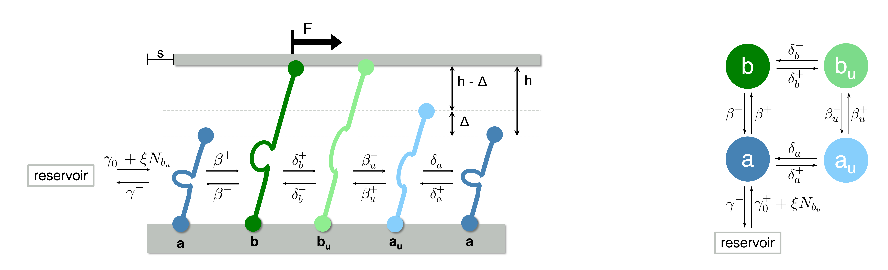

# HorizontalAdhesionModel

### Overview

In the framework of my Master thesis in the group of [Cell Biophysics and Statistical Physics](https://www.biostatphys.vetmed.uni-muenchen.de/index.html), we investigated the effect of vinculin binding to both force-induced unfolded talin and actin, which subsequently
triggers the recruitment of new talin in focal adhesions.

This project provides a minimalist model, which explores the dynamics of adhesion clusters in the presence of constant shear forces. The system is reduced to a single adapter molecule species (talin) that can undergo conformational changes when being stretched. As in an open system, molecules are exchanged between a reservoir
and the adhesion cluster. To account for adhesion growth upon molecule unfolding, we expand the reservoir rate to be proportional to the number of unfolded bound molecules.
 
This project contains python scripts for simulating the dynamics and for data analysis. Moreover, two Mathematica notebook are provided to compute analytical solutions of the mean-field equations. Example Data can be found in the respective folder.

### Files
#### Scripts
*HorizontalModel-ParallelizedForce.ipynb*: 
Simulation of the system. It is possible to run the code in parallel for different values of the force.

*HorizontalModel-ParallelizedXi.ipynb*:
Simulation of the system. It is possible to run the code in parallel for different values of xi.

*HorizontalModel-ForceSteps.ipynb*:
Simulation of the system where the force is increased step-like after a given time interval. It is possible to run the code in parallel for different values of xi.

*HorizontalModel-DataAnalysis.ipynb*:
Data analysis based on the simulations obtained by the above notebooks.

*NumericalSolutions.ipynb*:
Data analysis of numerical solutions obtained from *MacroscopicEquationsSolver.nb*. Derivation of the criterion of rupture.

*ExpansionTerms.nb*:
Computation of Taylor expansion terms up to 6th order.

*MacroscopicEquationsSolver.nb*:
Computation of occupation numbers in steady state for a given velocity and a given parameter xi.

#### Example Data
*MeanOcc_SteadyState_xi0-0.2_gp20_gm1_f0-80-4_molinit100-60-20-10_noreac600000_F0-1.pkl*:
example data set. Contains mean occupation numbers for a system in steady state for different xi (0, 0.05, 0.1, 0.15, 0.2) and forces ranging from 0-80 with a stepsize of 4.

*MeanVelocity_SteadyState_xi0-0.2_gp20_gm1_f0-80-4_molinit100-60-20-10_noreac600000_F0-1.pkl*:
example data set. Contains the corresponding velocities to the above mean occupation numbers.

*OrderCorrections_gp10-20_gm1.pkl*:
example data set. Contains the correction terms obtained by the Mathematica notebook.

*MathematicaValues.pkl* and *SimulationValues.pkl* are obtained from the notebook *MacroscopicEquationsSolver.nb* and analyzed in *NumericalSolutions.ipynb*.

*mean_xi0-012_final.pkl*:
Averaged simulated mean occupation values for xi $\in$ {0, 0.25, 0.5, 0.85, 0.95, 0.12}. Data is analyzed in *NumericalSolutions.ipynb*.